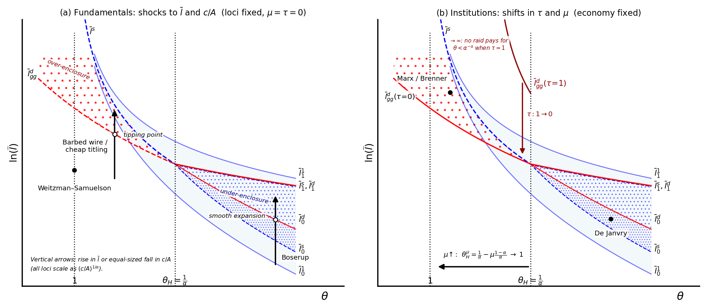

:::{warning}
**Temporary page.** This chapter exists only to share a draft figure for the
RESTUD final-revision round with Matt. It is not part of the site's
permanent structure and will be removed once the revision is finalized —
see the "TEMP" section in the table of contents.
:::

## Parameter-trajectories figure (draft)

Proposed for Section 6 of the paper, in response to Referee 2's request
(endorsed by the editor) to graphically show how parameter changes move the
enclosure equilibrium and relate to the over-/under-enclosure predictions.
See `paper/final_revisions.md` §1.4 for the full design spec and discussion.



**Draft caption.** Canonical enclosure narratives as parameter configurations
and comparative-static paths, drawn on the decision regions of Figure 5
($\alpha=2/3$, $c/A=1$). **Panel (a)** holds institutions at the benchmark
($\mu=\tau=0$) and moves fundamentals: at "Weitzman–Samuelson" ($\theta=1$,
below $\bar l_{gg}^d$) the commons persists and any enclosure would be purely
redistributive; the "Boserup" arrow shows rising population density in a
high-TFP economy crossing $\bar l_0^d$ into a smooth, continuous expansion of
partial enclosure; an arrow of identical length at low TFP gain ("barbed wire
/ cheap titling") instead crosses the global-games locus $\bar l_{gg}^d$ at a
tipping point, jumping discontinuously from no enclosure to full — and here
excessive — enclosure. Because every locus scales as $(c/A)^{1/\alpha}$, a
fall in enclosure costs $c$ or rise in baseline TFP $A$ shifts all loci down
by the same vertical distance, so $c/A$ shocks are drawn as the same vertical
arrows as increases in $\bar l$. **Panel (b)** holds the economy's
fundamentals fixed and moves institutions: requiring full compensation
($\tau=1$) shifts the enclosure-race locus $\bar l_{gg}^d$ far upward —
indeed no density triggers a raid for $\theta<\alpha^{-\alpha}$ — so an
economy such as "Marx/Brenner," lying between the $\tau=1$ and $\tau=0$
loci, experiences an enclosure cascade with no change in fundamentals when
customary users' power collapses ($\tau: 1\to 0$); stronger commons
governance pushes the strategic-complements threshold $\theta_H^\mu$
(eq. 26) left toward 1, shrinking the race-prone region; and "De Janvry"
marks a high-$\theta$ economy stuck in the under-enclosure band between
$\bar l_0^s$ and $\bar l_0^d$, where a socially beneficial transition fails
to start. Red-hatched (blue-hatched) regions mark over- (under-) enclosure,
as in Figure 5.

## Comparative statics table (draft)

| Change | In the figure | Equilibrium response | Efficiency verdict | Narrative |
|---|---|---|---|---|
| $\bar l \uparrow$ (population density) | Vertical arrow up, panel (a) | Smooth rise in $t_e^*$ if $\theta>\theta_H$; discontinuous jump $0\to 1$ on crossing $\bar l_{gg}^d$ if $\theta<\theta_H$ | Efficient intensification if $\theta$ high; dissipative race if $\theta$ low | Boserup; Hayami–Ruttan |
| $c/A \downarrow$ (cheaper enclosure / titling) | Same vertical arrow, panel (a) — all loci scale as $(c/A)^{1/\alpha}$ | Same as $\bar l \uparrow$ | Titling subsidies can tip a stable commons into a race | Hornbeck (barbed wire); de Soto-style programs |
| $\theta \uparrow$ (TFP gain from enclosure) | Horizontal arrow right; may cross $\theta_H^\mu$ | Regime switch complements $\to$ substitutes; labor switches from loser to gainer at $\theta_H^\mu$ | Under-enclosure becomes the risk | Allen vs. Heldring et al. |
| $\tau \downarrow$ (customary users' power collapses) | Decentralized loci sweep down, panel (b); planner loci fixed | Enclosure cascade where none occurred before, with no change in fundamentals | Over-enclosure region expands; raids profitable even at $\theta \le 1$ | Brenner; Anderson–McChesney "raid vs. trade" |
| $\mu \uparrow$ (stronger commons governance) | $\theta_H^\mu$ vertical moves left toward 1, panel (b) | Less labor misallocation; labor-gains threshold falls | Under-enclosure shrinks; but over-enclosure expands if $\tau=0$ (second-best warning) | Ostrom; ejido reforms (de Janvry et al. 2015) |

## Code

Generated by [`notebooks/generate_trajectories_figure.py`](generate_trajectories_figure.py),
which reuses the loci already defined in
[`enclose.py`](https://jhconning.github.io/enclosure_book/enclose.html).
Regenerate with:

```bash
python generate_trajectories_figure.py
```

from the `notebooks/` directory.
